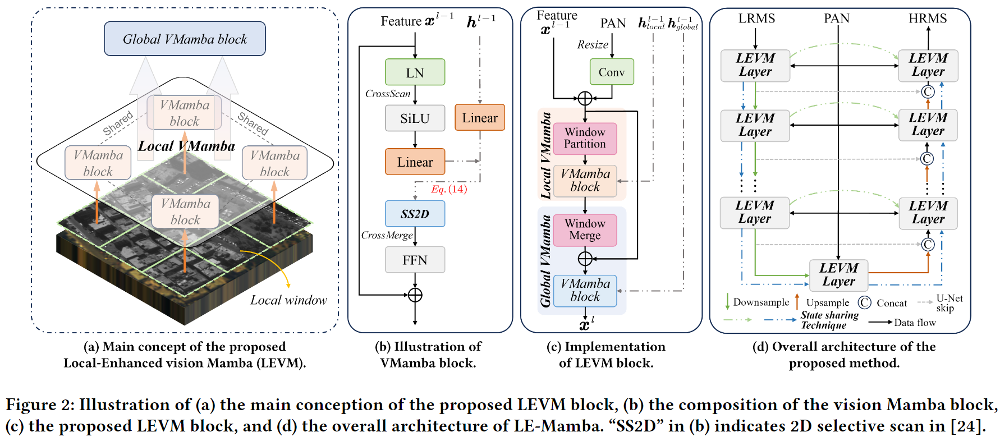
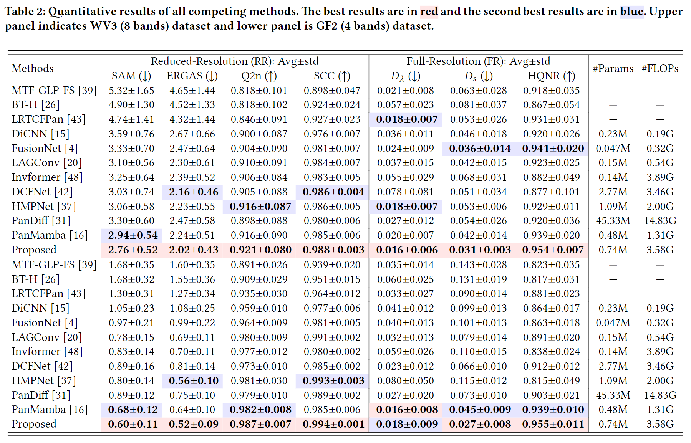
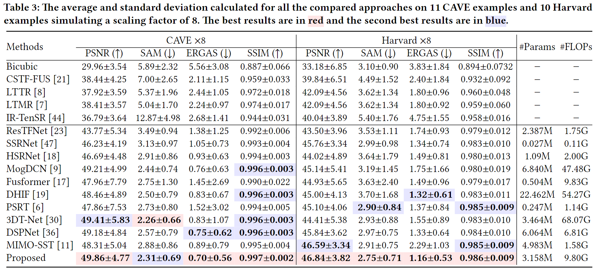

# A Novel State Space Model with Local Enhancement and State Sharing for Image Fusion

<div align="center">
<p style="text-align: center">
     <a href="https://scholar.google.com/citations?user=pv61p_EAAAAJ&hl=en", style="font-size: 18px;">Zihan Cao</a>
     &nbsp
     <a href="https://xiaoxiao-woo.github.io/", style="font-size: 18px;"> Xiao Wu </a>
     &nbsp
     <a href="https://liangjiandeng.github.io/", style="font-size: 18px;"> Liang-Jian Deng </a>
     <a style="font-size: 18px;"> Yu Zhong </a>
     <br>
     <a style="font-size: 16px;"> University of Electronic Science Technology of China </a>
</p>
</div>

[](https://arxiv.org/abs/2404.09293)

abtract: In image fusion tasks, images from different sources possess distinct characteristics. This has driven the development of numerous methods to explore better ways of fusing them while preserving their respective characteristics.
Mamba, as a state space model, has emerged in the field of natural language processing. Recently, many studies have attempted to extend Mamba to vision tasks. However, due to the nature of images different from causal language sequences, the limited state capacity of Mamba weakens its ability to model image information. Additionally, the sequence modeling ability of Mamba is only capable of spatial information and cannot effectively capture the rich spectral information in images. Motivated by these challenges, we customize and improve the vision Mamba network designed for the image fusion task. Specifically, we propose the local-enhanced vision Mamba block, dubbed as LEVM. The LEVM block can improve local information perception of the network and simultaneously learn local and global spatial information. Furthermore, we propose the state sharing technique to enhance spatial details and integrate spatial and spectral information. Finally, the overall network is a multi-scale structure based on vision Mamba, called LE-Mamba. Extensive experiments show the proposed methods achieve state-of-the-art results on multispectral pansharpening and multispectral and hyperspectral image fusion datasets, and demonstrate the effectiveness of the proposed approach.

<html>
<body>
    <div class="image-container" style="text-align: center;">
        
    </div>
</body>
</html>

# Model
We implement LE-Mamba with Pytorch and you can find it at [`model/LEMamba.py`](../model/LEMamba.py).

## Traning
To train the model, you should first compile the `select_scan` operator by running the following command:

```shell
cd model/module/mamba_scan
pip install -e .
```

Then, you should run the following command to test the model if it is correctly installed:

```shell
pytest model/test/LEMamba_test.py
```

If the test is passed, you can start training the model by running the following commands:

```shell
CUDA_VISIBLE_DEVICES="0" \
NCCL_P2P_LEVEL="NVL" \
NCCL_P2P_DISABLE="1" \
NCCL_IB_DISABLE="1" \
OMP_NUM_THREADS="6" \
accelerate launch \
--config_file configs/huggingface/accelerate.yaml \
accelerate_main.py \
--proj_name LE-Mamba \
--arch LEMamba \
--dataset <dataset_name> \
--num_worker 6 -e 800 -b 32 --aug_probs 0. 0. --loss l1ssim --grad_accum_steps 2 \
--checkpoint_every_n 20 --val_n_epoch 20  \
--comment "LE-Mamba config on wv3 dataset model" \
--log_metric \
--logger_on \
```

> check the `model/__init__.py` if the LE-Mamba network is not registered.

Checkpoints, running, and Tensorboard logs will be saved at `log_file/`.

## Testing

You can refer to the testing script [`torch_inference_on_sharpening.py`](../torch_inference_on_sharpening.py) to test the model.

To test the metrics, please see the main guidance in [`README.md`](../README.md).

For sharpening tasks (including pansharpening and HMIF tasks), you simply test the metrics in Matlab:
``` matlab
cd Pansharpening_Hyper_SR_Matlab_Test_Package

%% when testing the reduced-resolution metrics on pansharpening or HMIF tasks
% Args:
% path: the saved fused image `.mat` file, find it in `visualized_img/`
% ratio: upscale ratio, e.g., 4
% full_res: we keep it to 1, not changed
% const: max value of the dataset (WV3: 2047, GF2: 1023, CAVE x8: 1, Harvard x8: 1)
analysis_ref_batched_images(path, ratio, full_res, const)

%% when testing full-resolution metrics on pansharpening datasets
% Args:
% path: the saved fused image `.mat` file, find it in `visualized_img/`
% ratio: upscale ratio, e.g., 4
% sensor: the sensor name ('WV3', 'GF2', 'CAVE', 'Harvard')
analysis_unref_batched_images(path, ratio, sensor)
```

<!-- # Performances
LE-Mamba reaches SOTA performances on widely-used Pansharpening and HMIF datasets. Here are some metrics:

<html>
<body>
    <div class="image-container" style="text-align: center;">
        
    </div>
     <div class="image-container" style="text-align: center;">
        
    </div>
</body>
</html> -->

# Citation
If you find this work useful, please consider citing:
```bibtex
@inproceedings{
    cao2024novel,
    title={A novel state space model with local enhancement and state sharing for image fusion},
    author={Cao, Zihan and Wu, Xiao and Deng, Liang-Jian and Zhong, Yu},
    booktitle={ACM Multimedia 2024 (ACM MM)},
    year={2024}
}
```